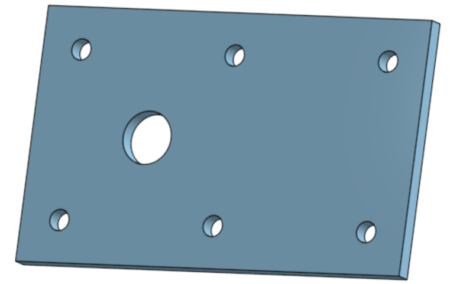
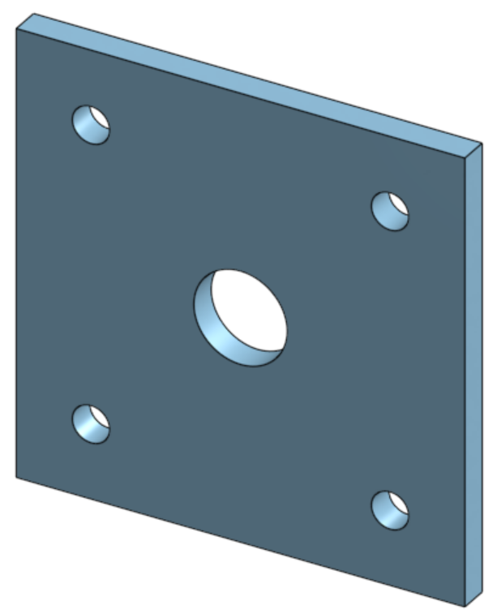
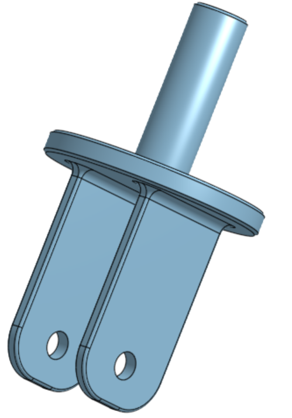
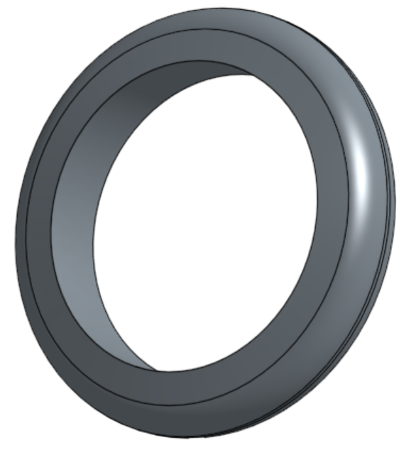
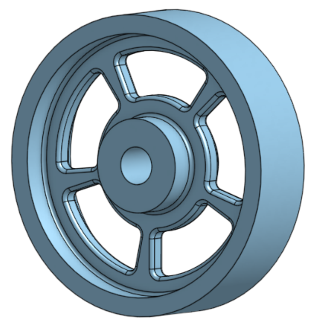
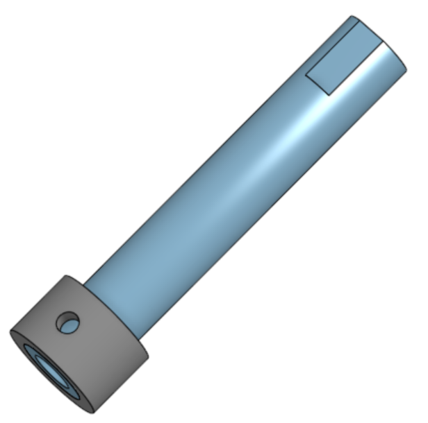
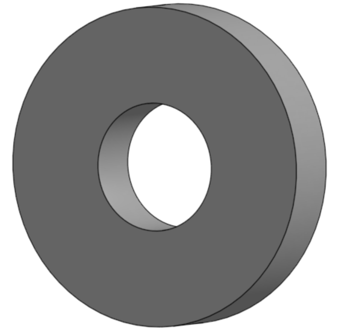
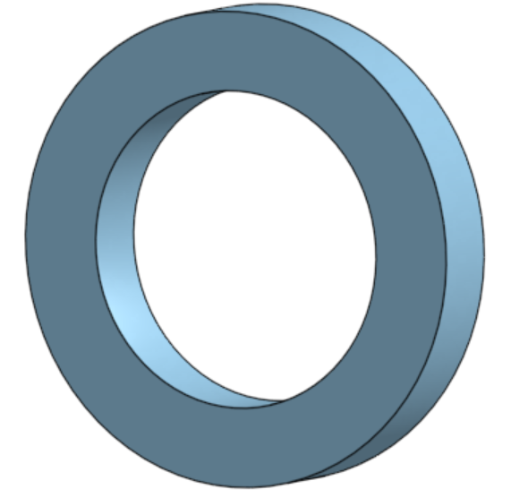

# Basic CAD

We are creating a caster.

---
## Table of Contents
* [Table of Contents](#Table-of-Contents)
* [Base](#Base)
* [Mount](#Mount)
* [Fork](#Fork)
* [Tire](#Tire)
* [Wheel](#Wheel)
* [Axle, Collar, Bearings](#axle-collar-bearings)

## Base

### Description

In this assignment I created the base to the caster. It is a rectangular prism that is 200 mm x 120 mm x 8 mm with 6 10 mm holes equally spaced 20 mm from the edge.

### Evidence
[Base in Onshape](https://cvilleschools.onshape.com/documents/f7ea84346f453cdc483ecf33/w/3f3de681c1975644dbaf9af1/e/ff0e314ea46238ffca21f6f5)

### Image

### Reflection

This assignment wasn't particularly challenging as the basics of Onshape aren't very different than Solidworks. One useful thing that I learned was some of the shortcuts:
* Shift + S to sketch
* C for circle
* Shift E to extrude

---

## Mount

### Description

In this assignment I created the mount part of the caster. It is a 120 mm square extruded 8 mm with a 25 mm hole in the center and four 10 mm holes whose centers are 20 mm away from the edge. 

### Evidence

[Mount in Onshape](https://cvilleschools.onshape.com/documents/f7ea84346f453cdc483ecf33/w/3f3de681c1975644dbaf9af1/e/91c56482de702136a5da5df5)

### Image

### Reflection

This assignment also wasn't a challenge, but one thing I learned in the tutorial video was how make multiple parts in the same part studio by selecting "New" instead of "Add" when you extrude.

---

## Fork

### Description

In this assignment I designed the fork that attaches the axle to the base of the caster. It has a circular base with two prongs, with holes for the axle, and a cylinder on the top that attaches to the base.

### Evidence

[Fork in Onshape](https://cvilleschools.onshape.com/documents/f7ea84346f453cdc483ecf33/w/3f3de681c1975644dbaf9af1/e/311adde7d379ff01d171e869)

### Image

### Reflection

One thing that I learned is that you can select tangent propogation when doing a fillet to automatically select all edges tangent to the one you select; also the shortcut for a fillet is Shift + F.

---

## Tire

### Description

In this assignment I designed the tire of the caster. It is a trapezoid revolved around the origin to make the wheel, with fillets on both sides to round the edges.

### Evidence

[Tire in Onshape](https://cvilleschools.onshape.com/documents/f7ea84346f453cdc483ecf33/w/3f3de681c1975644dbaf9af1/e/4638a4e0a262051462ff2519)

### Image

### Reflection

Something useful that I learned is that if you place a dimension between a centerline and another line past the centerline, it doubles, making it convenient for making diameter.

---

## Wheel

### Description

In this assignment I designed the wheel of the caster. It is revolved I shape with holes cut to make spokes, then some fillets.

### Evidence

[Wheel in Onshape](https://cvilleschools.onshape.com/documents/f7ea84346f453cdc483ecf33/w/3f3de681c1975644dbaf9af1/e/83922fdb04da7216fde9ab66)

### Image

### Reflection

One thing that I learned in this assignment is that when you are doing a fillet or chamfer you can click a face and all of its edges will be automatically selected.

---

## Axle, Collar, Bearings

### Description

In this assignment I made the axe, which is a cylinder with flat cuts on the ends for set screws, a collar that attaches to the end of the axle, and two different sized bearings.

### Evidence

[Axle and Collar in Onshape](https://cvilleschools.onshape.com/documents/f7ea84346f453cdc483ecf33/w/3f3de681c1975644dbaf9af1/e/20dcd05ba3e4f98628545047)  
[Bearing](https://cvilleschools.onshape.com/documents/f7ea84346f453cdc483ecf33/w/3f3de681c1975644dbaf9af1/e/83922fdb04da7216fde9ab66)  
[Big Bearing](https://cvilleschools.onshape.com/documents/f7ea84346f453cdc483ecf33/w/3f3de681c1975644dbaf9af1/e/955b13e9be52c47d23ce51c9)

### Image

### Reflection

This assignment showed me how easiy it is to use part studios to make multiple parts without even having to make any new sketches.

---
